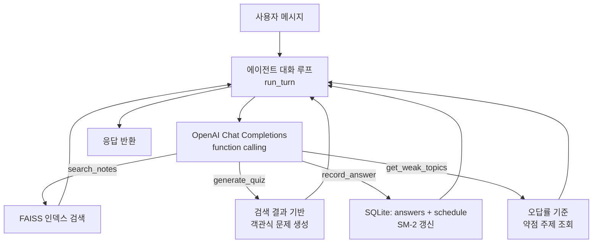
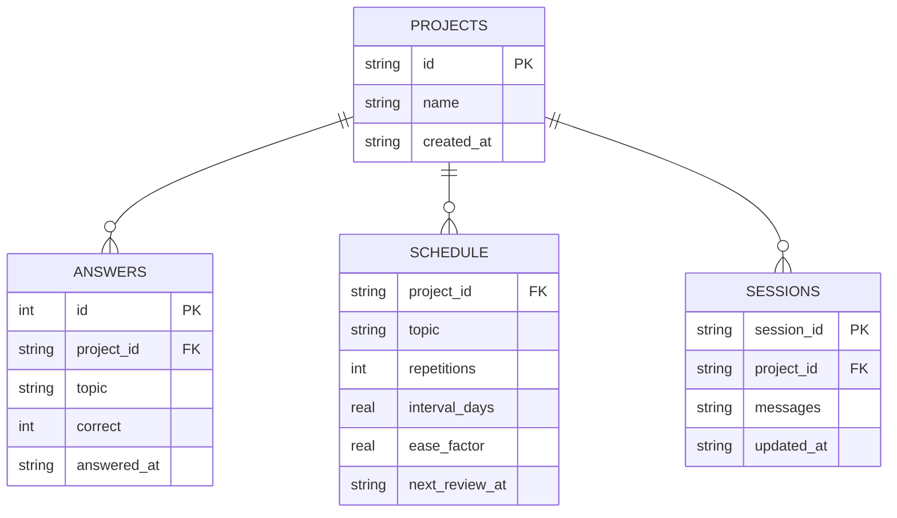

<div align="center">

# 🧠 Study Agent

**노트를 읽고, 퀴즈를 내고, 내가 뭘 틀렸는지 기억하는 학습 에이전트**

RAG로 내 노트를 검색하고, 약점 주제를 우선 출제하고, SM-2 기반으로 복습 시점까지 관리합니다


</div>

## ✨ Study Agent란?

**Study Agent**는 PDF/Markdown/텍스트 노트를 업로드하면 그 내용을 기반으로 질문에 답하고 퀴즈를 내주는 학습 에이전트입니다. 단순 RAG 챗봇에서 멈추지 않고, 퀴즈 정답/오답을 주제별로 기록해서 **약점 주제를 우선 출제**하고 **SM-2 간이 알고리즘으로 복습 시점**을 계산합니다.

과목(프로젝트) 단위로 노트·인덱스·학습 기록을 분리 관리하며, OpenAI function calling으로 에이전트가 검색·퀴즈 생성·기록 도구를 스스로 호출합니다.

## 🎯 핵심 기능

| | 기능 |
|---|---|
| 🔍 | 노트를 청크 단위로 임베딩해 FAISS로 검색 (`search_notes`) |
| 🧩 | 검색된 노트 내용을 바탕으로 객관식 퀴즈 생성 (`generate_quiz`) |
| 📉 | 정답/오답을 주제별로 기록하고 오답률 높은 약점 주제 조회 (`record_answer`, `get_weak_topics`) |
| 🔁 | SM-2 간이 알고리즘으로 다음 복습 시점 계산, 로그인 시 복습 대상 주제 안내 |
| 📁 | 과목(프로젝트)별로 노트/인덱스/학습 기록 분리 |
| 💬 | 대화 세션을 SQLite에 저장해 재시작해도 이어서 대화 |

## 🏗 에이전트 동작 흐름



## 📁 프로젝트 구조

```
study-agent/
├── server.py                  # FastAPI 앱 (API 라우트)
├── src/
│   ├── agent.py                # 툴 호출 대화 루프 (system prompt, run_turn)
│   ├── tools.py                 # OpenAI function-calling 스키마 + 구현
│   ├── ingest.py                # 노트 청크 분할 → 임베딩 → FAISS 인덱스 생성
│   ├── search.py                # FAISS 인덱스 검색 (프로젝트별 캐시)
│   ├── tracker.py               # 정답/오답 기록 + SM-2 간이 복습 스케줄
│   ├── projects.py              # 프로젝트(과목) CRUD
│   ├── sessions.py              # 대화 세션 저장/로드
│   └── config.py                # pydantic-settings 기반 설정
├── frontend/                   # React (Vite) 프런트엔드
│   └── src/
│       ├── pages/                # Landing, ChatApp, Projects
│       └── components/           # ChatWindow, ChatMessage, Sidebar, Logo
├── tests/                       # pytest (66개 테스트)
├── data/                        # SQLite DB, 프로젝트별 노트/인덱스 (gitignored)
└── .github/workflows/            # CI: ruff lint + pytest + frontend build
```

## 🗄 데이터 모델

SQLite (`data/tracker.db`)에 프로젝트, 퀴즈 답변 기록, 복습 스케줄을 저장합니다.



> `SCHEDULE`의 PK는 `(project_id, topic)` 복합키입니다. 정답이면 반복 횟수가 늘고 간격이 늘어나고(ease factor 최대 3.0), 오답이면 반복이 0으로 리셋되고 간격이 1일로 줄어듭니다 (`src/tracker.py`의 `_next_schedule`).

## 🛠 기술 스택

| 영역 | 기술 |
|---|---|
| Backend | Python 3.13 · FastAPI · Uvicorn |
| LLM | OpenAI API (`gpt-4o-mini`, function calling) |
| 벡터 검색 | FAISS (`IndexFlatIP`, 코사인 유사도) |
| 임베딩 | OpenAI `text-embedding-3-small` |
| DB | SQLite (프로젝트/학습 기록/세션) |
| Frontend | React 18 · Vite · react-router-dom |
| 품질 관리 | Ruff (lint) · pytest · GitHub Actions CI |

## 🚀 시작하기

### 사전 요구사항

- Python 3.13
- Node.js 20+
- OpenAI API 키

### 백엔드

```bash
python -m venv venv
source venv/bin/activate
pip install -r requirements.txt

cp .env.example .env
# .env에 OPENAI_API_KEY 입력

uvicorn server:app --reload
```

### 프런트엔드

```bash
cd frontend
npm install
npm run dev
```

프런트엔드는 기본적으로 `http://localhost:5173`에서 실행되고, `cors_origins` 설정으로 백엔드와 통신합니다 (`src/config.py`).

### 노트 색인 (CLI)

```bash
python -m src.ingest <project_id>
```

`data/projects/<project_id>/notes/`에 PDF/Markdown/텍스트 파일을 넣고 실행하면 FAISS 인덱스가 생성됩니다. API로 업로드하면 (`POST /api/notes`) 자동으로 색인됩니다.

## 📡 API

| Method | Endpoint | 설명 |
|---|---|---|
| POST | `/api/projects` | 프로젝트(과목) 생성 |
| GET | `/api/projects` | 프로젝트 목록 조회 |
| POST | `/api/session` | 대화 세션 생성 (복습 예정 주제 있으면 먼저 안내) |
| POST | `/api/chat` | 메시지 전송, 에이전트 턴 실행 |
| POST | `/api/reset` | 대화 초기화 |
| GET | `/api/weak-topics` | 오답률 기준 약점 주제 조회 |
| GET | `/api/notes` | 프로젝트의 노트 파일/청크 수 조회 |
| POST | `/api/notes` | 노트 업로드 (PDF/MD/TXT) 후 자동 색인 |

## 🧪 테스트 & CI

```bash
ruff check .
pytest -q
```

`main` 브랜치 push/PR마다 GitHub Actions에서 백엔드 lint+test, 프런트엔드 빌드를 검증합니다 (`.github/workflows/`).

## 📌 상태

RAG 검색, 퀴즈 생성, 약점 트래킹, SM-2 복습 스케줄링, 세션 영속화까지 구현 완료. FastAPI + React 기반 UI를 계속 확장 중입니다.
