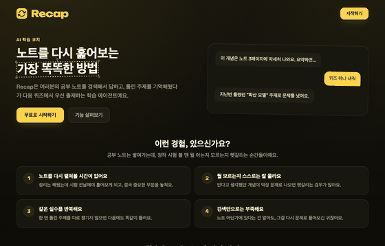
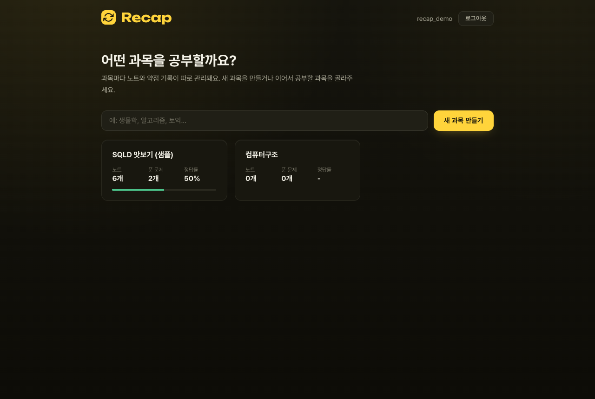
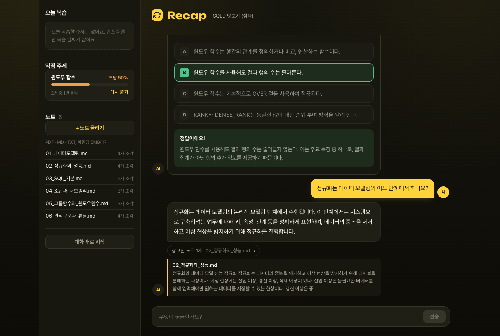
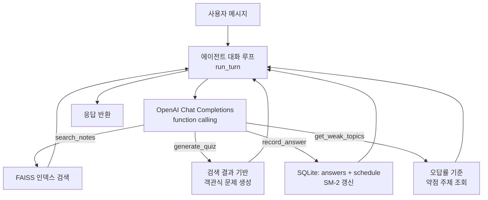
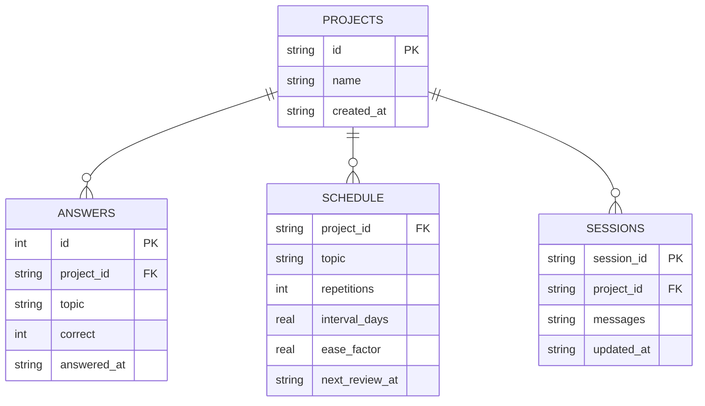

<div align="center">

# 🧠 Recap (Study Agent)

**노트를 읽고, 퀴즈를 내고, 내가 뭘 틀렸는지 기억하는 학습 에이전트**

RAG로 내 노트를 검색하고, 약점 주제를 우선 출제하고, SM-2 기반으로 복습 시점까지 관리합니다


</div>

## ✨ Study Agent란?

**Study Agent**는 PDF/Markdown/텍스트 노트를 업로드하면 그 내용을 기반으로 질문에 답하고 퀴즈를 내주는 학습 에이전트입니다. 단순 RAG 챗봇에서 멈추지 않고, 퀴즈 정답/오답을 주제별로 기록해서 **약점 주제를 우선 출제**하고 **SM-2 간이 알고리즘으로 복습 시점**을 계산합니다.

과목(프로젝트) 단위로 노트·인덱스·학습 기록을 분리 관리하며, OpenAI function calling으로 에이전트가 검색·퀴즈 생성·기록 도구를 스스로 호출합니다.

## 📸 스크린샷



| 과목 선택 | 학습 채팅 |
|---|---|
|  |  |

## 🎯 핵심 기능

| | 기능 |
|---|---|
| 🔍 | 노트를 청크 단위로 임베딩해 FAISS로 검색 (`search_notes`) |
| 🧩 | 검색된 노트 내용을 바탕으로 객관식 퀴즈 생성 (`generate_quiz`) |
| 📉 | 정답/오답을 주제별로 기록하고 오답률 높은 약점 주제 조회 (`record_answer`, `get_weak_topics`) |
| 🔁 | SM-2 간이 알고리즘으로 다음 복습 시점 계산, 로그인 시 복습 대상 주제 안내 |
| 📁 | 과목(프로젝트)별로 노트/인덱스/학습 기록 분리 |
| 💬 | 대화 세션을 SQLite에 저장해 재시작해도 이어서 대화 |

## 📊 데이터 기준 개선

### 문제
SQLD 학습에 Recap을 2주 이상 직접 사용하던 중, 1회 시도해 1회 틀린 주제가 10회 시도해 9회 틀린 주제보다 더 큰 약점으로 정렬되는 것을 발견했습니다.

### 원인
오답률(`wrong_rate`) 계산 자체는 정확했지만, 표본 수가 다른 주제를 동일한 기준으로 비교하고 있었습니다. 시도 1회인 주제는 우연히 한 번 틀렸을 뿐이어도 오답률이 100%로 계산돼, 시도 10회 중 9회 틀린 주제(90%)보다 순위가 높아졌습니다.

### 개선
이 상황을 실패 테스트로 먼저 재현한 뒤, 시도 횟수가 적을 때는 극단적인 비율을 완화하는 보정값을 정렬 기준에 도입했습니다.

```python
adjusted_wrong_rate = (wrong + 1) / (attempts + 2)
```

화면에 보여주는 `wrong_rate`(실제 오답률)는 그대로 유지하고, 약점 주제 **정렬에만** `adjusted_wrong_rate`(보정 점수)를 사용합니다.

| 주제 | 시도/오답 | wrong_rate (화면 표시) | adjusted_wrong_rate (정렬 기준) |
|---|---:|---:|---:|
| A | 1회/1회 | 100% | 66.7% |
| B | 10회/9회 | 90% | 83.3% |

보정 후에는 B가 A보다 높은 순위로 정렬됩니다.

### 검증
표본 증가, 오답 0회, 동률, 저표본 주제가 고표본 약점을 역전하지 않는지 등 경계 조건을 테스트로 추가하고, 전체 회귀 테스트와 CI로 기존 기능에 영향이 없는지 확인했습니다 (`src/tracker.py`의 `_adjusted_wrong_rate`, `tests/test_tracker.py`).

## 🏗 에이전트 동작 흐름


```mermaid
flowchart TD
    U[사용자 메시지] --> A[에이전트 대화 루프<br/>run_turn]
    A --> M[OpenAI Chat Completions<br/>function calling]
    M -->|search_notes| S[FAISS 인덱스 검색]
    M -->|generate_quiz| Q[검색 결과 기반<br/>객관식 문제 생성]
    M -->|record_answer| R[SQLite: answers + schedule<br/>SM-2 갱신]
    M -->|get_weak_topics| W[오답률 기준<br/>약점 주제 조회]
    S --> A
    Q --> A
    R --> A
    W --> A
    A --> O[응답 반환]
```

## 📁 프로젝트 구조

```
study-agent/
├── server.py                  # FastAPI 앱 (API 라우트)
├── src/
│   ├── agent.py                # 툴 호출 대화 루프 (system prompt, run_turn)
│   ├── tools.py                 # OpenAI function-calling 스키마 + 구현
│   ├── ingest.py                # 노트 청크 분할 → 임베딩 → FAISS 인덱스 생성
│   ├── search.py                # FAISS 인덱스 검색 (프로젝트별 캐시)
│   ├── tracker.py               # 정답/오답 기록 + SM-2 간이 복습 스케줄
│   ├── projects.py              # 프로젝트(과목) CRUD
│   ├── sessions.py              # 대화 세션 저장/로드
│   └── config.py                # pydantic-settings 기반 설정
├── frontend/                   # React (Vite) 프론트엔드
│   └── src/
│       ├── pages/                # Landing, ChatApp, Projects
│       └── components/           # ChatWindow, ChatMessage, Sidebar, Logo
├── eval/                        # RAG 품질 평가 (SQLD 노트 6개, 질문 38개, 결과 JSON)
├── tests/                       # pytest (96개 테스트)
├── data/                        # SQLite DB, 프로젝트별 노트/인덱스 (gitignored)
└── .github/workflows/            # CI: ruff lint + pytest + frontend build
```

## 🗄 데이터 모델

SQLite (`data/tracker.db`)에 프로젝트, 퀴즈 답변 기록, 복습 스케줄을 저장합니다.


```mermaid
erDiagram
    PROJECTS ||--o{ ANSWERS : ""
    PROJECTS ||--o{ SCHEDULE : ""
    PROJECTS ||--o{ SESSIONS : ""

    PROJECTS {
        string id PK
        string name
        string created_at
    }
    ANSWERS {
        int id PK
        string project_id FK
        string topic
        int correct
        string answered_at
    }
    SCHEDULE {
        string project_id FK
        string topic
        int repetitions
        real interval_days
        real ease_factor
        string next_review_at
    }
    SESSIONS {
        string session_id PK
        string project_id FK
        string messages
        string updated_at
    }
```

> `SCHEDULE`의 PK는 `(project_id, topic)` 복합키입니다. 정답이면 반복 횟수가 늘고 간격이 늘어나고(ease factor 최대 3.0), 오답이면 반복이 0으로 리셋되고 간격이 1일로 줄어듭니다 (`src/tracker.py`의 `_next_schedule`).

## 🛠 기술 스택

| 영역 | 기술 |
|---|---|
| Backend | Python 3.13 · FastAPI · Uvicorn |
| LLM | OpenAI API (`gpt-4o-mini`, function calling) |
| 벡터 검색 | FAISS (`IndexFlatIP`, 코사인 유사도) |
| 임베딩 | OpenAI `text-embedding-3-small` |
| DB | SQLite (프로젝트/학습 기록/세션) |
| Frontend | React 18 · Vite · react-router-dom |
| 품질 관리 | Ruff (lint) · pytest · GitHub Actions CI |

## 🚀 시작하기

### 사전 요구사항

- Python 3.13
- Node.js 20+
- OpenAI API 키

### 백엔드

```bash
python -m venv venv
source venv/bin/activate
pip install -r requirements.txt

cp .env.example .env
# .env에 OPENAI_API_KEY 입력

uvicorn server:app --reload
```

### 프론트엔드

```bash
cd frontend
npm install
npm run dev
```

프론트엔드는 기본적으로 `http://localhost:5173`에서 실행되고, `cors_origins` 설정으로 백엔드와 통신합니다 (`src/config.py`).

### Docker로 실행

```bash
cp .env.example .env
# .env에 OPENAI_API_KEY 입력

docker compose up --build
```

`http://localhost:8000`에서 바로 사용할 수 있습니다. 이미지 빌드 단계에서 React를 빌드하고, FastAPI가 API와 빌드된 화면을 함께 서빙합니다. 노트·FAISS 인덱스·학습 기록(`data/`)은 볼륨으로 연결돼 컨테이너를 다시 만들어도 유지됩니다.

### Fly.io 배포

Docker 이미지를 그대로 배포합니다. SQLite와 FAISS 인덱스가 있는 `/app/data`에 볼륨을 붙여 재배포해도 데이터가 남습니다 (`fly.toml`).

```bash
fly launch --no-deploy --copy-config        # 앱 이름은 fly.toml의 app 값
fly volumes create recap_data --size 1 --region nrt
fly secrets set OPENAI_API_KEY=... ACCESS_PASSWORD=...
fly deploy
```

`ACCESS_PASSWORD`를 설정하면 헬스체크(`/api/health`)를 뺀 모든 요청에 HTTP Basic 인증이 걸립니다. 공개 URL로 OpenAI 키가 소모되는 것을 막기 위한 장치이고, 브라우저가 로그인 창을 띄운 뒤 같은 출처 요청에 자격 증명을 계속 붙여 보내므로 프론트엔드 수정은 필요 없습니다.

### 노트 색인 (CLI)

```bash
python -m src.ingest <project_id>
```

`data/projects/<project_id>/notes/`에 PDF/Markdown/텍스트 파일을 넣고 실행하면 FAISS 인덱스가 생성됩니다. API로 업로드하면 (`POST /api/notes`) 자동으로 색인됩니다.

## 📡 API

| Method | Endpoint | 설명 |
|---|---|---|
| GET | `/api/health` | 헬스체크 (인증 없이 접근 가능) |
| POST | `/api/projects` | 프로젝트(과목) 생성 |
| GET | `/api/projects` | 프로젝트 목록 조회 |
| POST | `/api/session` | 대화 세션 생성 (복습 예정 주제 있으면 먼저 안내) |
| POST | `/api/chat` | 메시지 전송, 에이전트 턴 실행 |
| POST | `/api/reset` | 대화 초기화 |
| GET | `/api/weak-topics` | 오답률 기준 약점 주제 조회 |
| GET | `/api/notes` | 프로젝트의 노트 파일/청크 수 조회 |
| POST | `/api/notes` | 노트 업로드 (PDF/MD/TXT) 후 자동 색인 |

## 📏 RAG 품질 평가

체감이 아니라 숫자로 검색·답변 품질을 확인하려고 고정 평가셋을 만들었습니다 (`eval/`).

- **코퍼스**: SQLD 개념 노트 6개 (데이터 모델링, 정규화, SQL 기본, 조인·서브쿼리, 윈도우 함수, 인덱스·튜닝 / 약 1.1만 자)
- **질문 38개**: 노트에 답이 있는 질문 32개 + 노트에 없는 질문 6개. 질문은 노트 문장을 그대로 베끼지 않고 실제로 물어볼 법한 말투로 작성
- **정답 라벨**: 질문마다 노트에서 근거 문장(짧은 구절)을 지정. 검색된 청크에 그 구절이 들어 있으면 정답 청크로 판정하므로 청크 크기를 바꿔도 라벨을 다시 만들 필요가 없음

```bash
python -m eval.run_eval                            # 검색 평가: 청크 300/500/800 비교
python -m eval.run_eval --chunk-sizes 800 --answers   # 실제 에이전트(run_turn) 답변까지 평가
```

### 검색 (overlap 100, top-k 검색)

| chunk_size | 청크 수 | Hit@1 | Hit@3 | Hit@5 | MRR |
|---:|---:|---:|---:|---:|---:|
| 300 | 73 | 65.6% | 84.4% | 90.6% | 0.758 |
| 500 | 38 | 56.2% | 84.4% | 93.8% | 0.718 |
| **800 (현재)** | 23 | 56.2% | 96.9% | 100.0% | 0.753 |

작은 청크는 1위 정확도(Hit@1)가 높지만, 설명이 여러 청크로 쪼개지면서 "결합 인덱스 컬럼 순서", "GROUPING SETS"처럼 아예 top-5 밖으로 밀리는 질문이 생겼습니다. 에이전트는 상위 5개를 모두 읽고 답하므로 Hit@5가 가장 높은 800을 유지했습니다. 다만 코퍼스가 작아 800에서는 top-5가 전체 청크의 약 22%라는 점은 감안해야 합니다.

### 답변 (chunk 800, `gpt-4o-mini`, 채점도 `gpt-4o-mini`)

| 지표 | 값 | 의미 |
|---|---:|---|
| 정확도 | 96.9% (31/32) | 답이 있는 질문에 정답과 같은 내용을 말함 |
| 노트에 없는 질문 거절률 | 100% (6/6) | "노트에 없다"고 답함 |
| 잘못된 거절 | 0% | 답이 있는데 모른다고 한 경우 |
| 검색 호출률 | 100% | 답하기 전에 `search_notes`를 호출함 |
| 응답 시간 p50 | 2.55초 | 툴 호출 포함 한 턴 |

**틀린 사례**: "정규화는 데이터 모델링의 어느 단계에서 하나요?"에 노트의 "논리적 모델링 단계" 대신 일반 지식으로 "설계 단계"라고 답했습니다. 정답 청크는 검색 결과 3위에 있었지만, 모델이 노트보다 사전 지식을 우선했습니다. 같은 답을 채점 모델은 근거 있음(grounded)으로 판정해, LLM 채점이 근거성을 관대하게 본다는 한계도 확인했습니다. 근거성 지표(100%)는 그래서 참고용으로만 봅니다.

## 🧪 테스트 & CI

```bash
ruff check .
pytest -q
```

pytest 96개로 약점 주제 순위·보정 점수, SM-2 복습 간격(정답/오답에 따른 다음 복습 시점), 프로젝트별 노트·학습 기록 분리, 대화 세션 저장·조회, 빈 인덱스/빈 학습 기록 처리, API 엔드포인트 동작, 접근 비밀번호, RAG 평가 지표 계산을 검증합니다 (`tests/`, 10개 모듈).

`main` 브랜치 push/PR마다 GitHub Actions에서 Ruff lint, pytest, 프론트엔드 빌드를 검증합니다 (`.github/workflows/`).

## 📌 상태

RAG 검색, 퀴즈 생성, 약점 트래킹, SM-2 복습 스케줄링, 세션 영속화까지 구현 완료. 다크 테마 + 스크롤 리빌 애니메이션을 적용한 랜딩 페이지로 UI를 리디자인했고, FastAPI + React 기반 UI를 계속 확장 중입니다.
